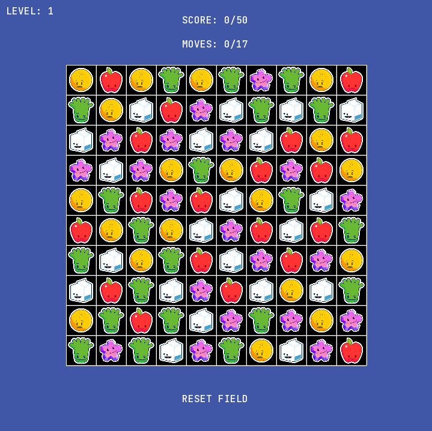

# Simple Match 3 Game
To gain score in this game you should choose two neighbouring tiles to swap them. They will swap if afterwards there will be a matching line of more than 2 tiles.
## Control
Choose tiles by clicking on them with left mouse button.

Reset field by clicking on reset button with left mouse button.

